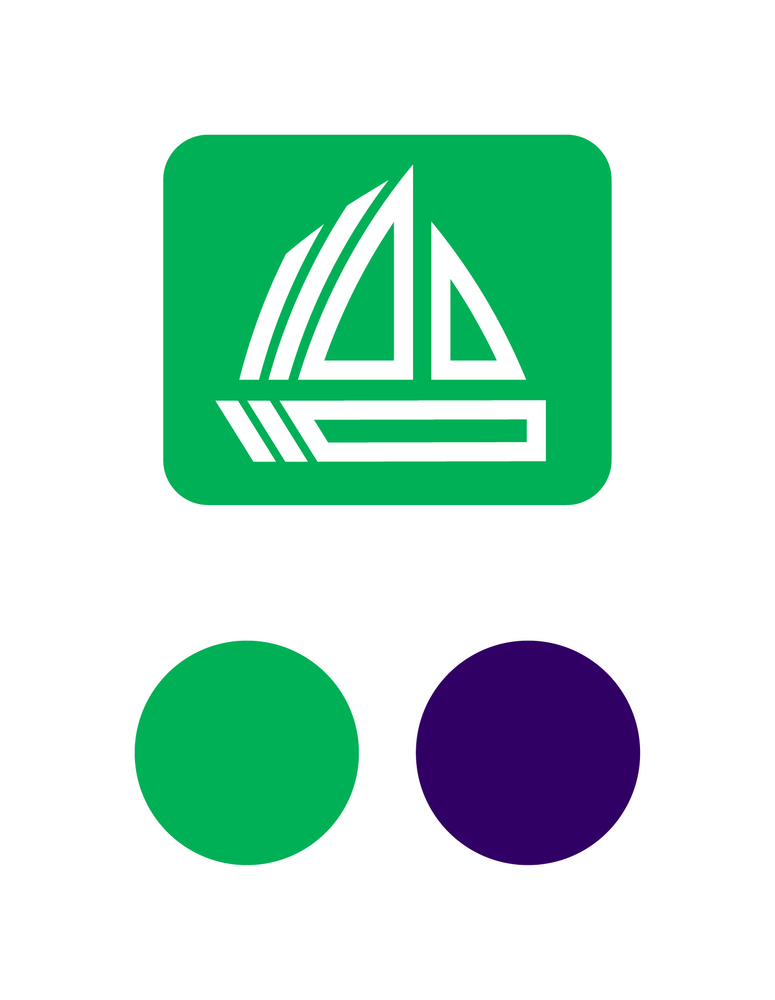
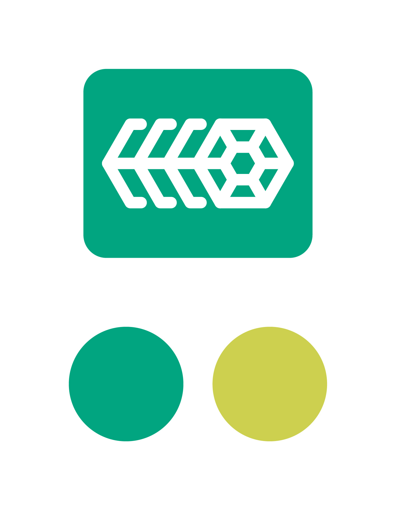
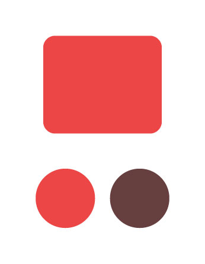
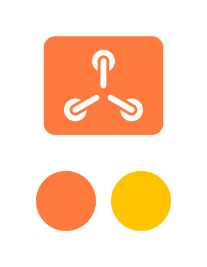
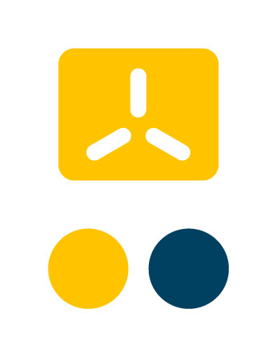
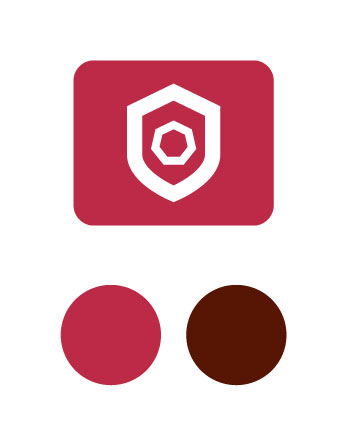
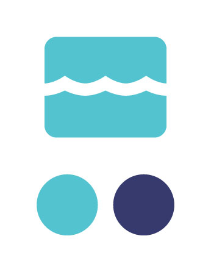
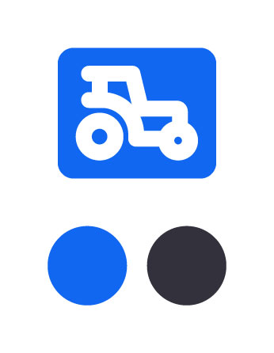

## epinio
  - primary: #004d93
  - secondary: #5ea6c1
  
  
## fleet
  - primary: #00b056
  - secondary: #362864
  
  
## harvester
  - primary: #00a580
  - secondary: #ccd04f
  
  
## hobbyfarm-placeholder
  - primary: #ec4646
  - secondary: #663f3f
  
  
## hypper
  - primary: #d13306
  - secondary: #f58357
  
  
## k3os
  - primary: #ff7a3d
  - secondary: #ffc400
  
  
## k3s
  - primary: #ffc400
  - secondary: #004061
  
  
## kubewarden
  - primary: #bc2a46
  - secondary: #561503
  
  
## longhorn
  - primary: #671c4c
  - secondary: #ff192e
  
  
## opni
  - primary: #a453b9
  - secondary: #ede053
  
  
## rancher-desktop
  - primary: #0081be
  - secondary: #78c9cf
  
  
## rio
  - primary: #53c3d0
  - secondary: #363a6e
  
  
## rke
  - primary: #1167f1
  - secondary: #33313c
  
  
## submariner
  - primary: #00e3c2
  - secondary: #1167f1
  
